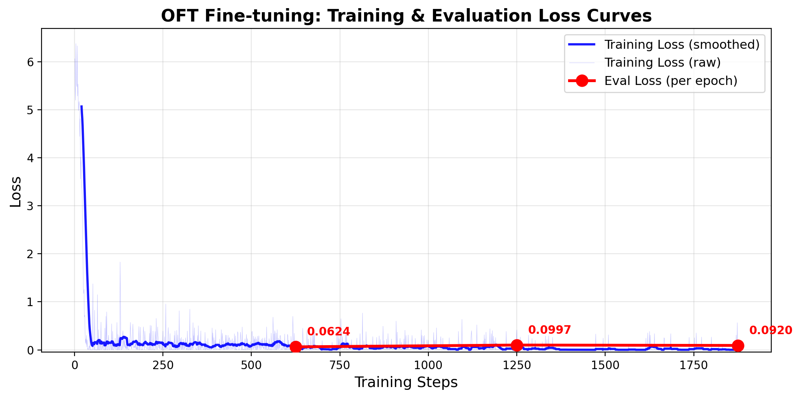
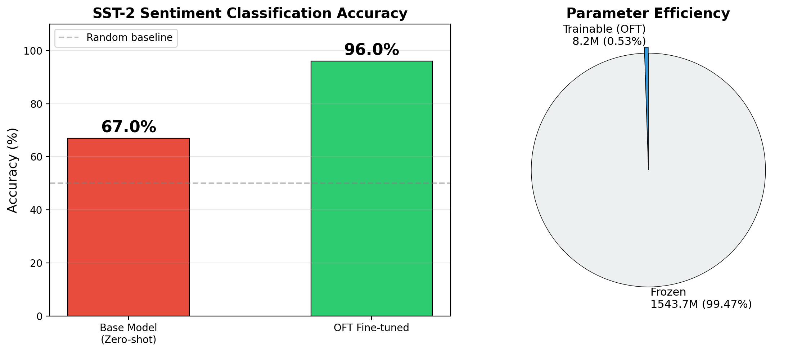

# OFT Fine-tuning for Pretrained Language Models

## Mini-Project: Parameter-efficient Finetuning for Pretrained Foundation Models

This project demonstrates **Orthogonal Fine-Tuning (OFT)** applied to the **Qwen2.5-1.5B** language model for **sentiment analysis** on the SST-2 dataset. OFT is a parameter-efficient fine-tuning (PEFT) method that preserves the hyperspherical energy of pretrained models by constraining weight updates to be orthogonal transformations.

---

## Results Summary

| Metric | Value |
|---|---|
| **Base Model Accuracy** | 67.00% |
| **Fine-tuned Accuracy** | **96.00%** |
| **Improvement** | +29.00% |
| **Trainable Parameters** | 8.2M / 1.55B (0.53%) |
| **Training Time** | ~5 minutes |
| **GPU** | NVIDIA GeForce RTX 5090 |

### Training Loss Curve



### Accuracy Comparison



---

## Project Structure

```
miniproject/
├── train_oft.py              # Main training script (OFT fine-tuning)
├── generate_figures.py       # Figure generation script for report
├── requirements.txt          # Python dependencies
├── README.md                 # This file
├── report.md                 # 3-page project report
└── output/
    ├── fig1_training_loss.png        # Training & eval loss curves
    ├── fig2_accuracy_comparison.png  # Accuracy comparison + parameter efficiency
    ├── fig3_qualitative_results.png  # Qualitative examples table
    ├── results.json                  # Full experiment results
    ├── base_model_results.json       # Base model evaluation results
    ├── qualitative_examples.json     # Sample predictions (before vs after)
    └── oft_adapter/                  # Saved OFT adapter weights
```

---

## Setup & Installation

### Prerequisites
- Python 3.10+
- NVIDIA GPU with CUDA support (tested on RTX 5090, 32GB VRAM)

### Install Dependencies

```bash
# Create and activate virtual environment
python -m venv .venv
source .venv/bin/activate

# Install dependencies
pip install -r requirements.txt
```

---

## Usage

### Run Training

```bash
python train_oft.py
```

### Custom Configuration

```bash
python train_oft.py \
    --model_name Qwen/Qwen2.5-1.5B \
    --num_epochs 3 \
    --batch_size 8 \
    --lr 1e-4 \
    --oft_r 8 \
    --train_samples 5000 \
    --eval_samples 200 \
    --output_dir ./output
```

### Key Arguments

| Argument | Default | Description |
|---|---|---|
| `--model_name` | `Qwen/Qwen2.5-1.5B` | HuggingFace model name |
| `--num_epochs` | `3` | Number of training epochs |
| `--batch_size` | `8` | Batch size per GPU |
| `--lr` | `1e-4` | Learning rate |
| `--oft_r` | `8` | OFT rank (number of orthogonal blocks) |
| `--train_samples` | `5000` | Number of training samples |
| `--eval_samples` | `200` | Number of evaluation samples |
| `--max_len` | `128` | Maximum sequence length |

---

## Method

### OFT (Orthogonal Fine-Tuning)

OFT constrains the fine-tuning updates to be orthogonal transformations applied to pretrained weight matrices. This preserves:
- **Hyperspherical energy**: maintains angular relationships between neurons
- **Model knowledge**: prevents catastrophic forgetting
- **Parameter efficiency**: only a small orthogonal matrix is learned

In this implementation:
- **Target modules**: `q_proj` and `v_proj` (attention query and value projections)
- **OFT rank (r)**: 8 (number of orthogonal blocks)
- **Trainable parameters**: 8.2M out of 1.55B total (0.53%)

### Task: Sentiment Analysis (SST-2)

The task is formulated as text generation: given a movie review, the model generates "positive" or "negative".

**Prompt template:**
```
Classify the sentiment of the following movie review as 'positive' or 'negative'.

Review: {text}

Sentiment: 
```

---

## Outputs

After training (`train_oft.py`) and figure generation (`generate_figures.py`), the following files are saved in `output/`:

- **`fig1_training_loss.png`** — Training & evaluation loss curves
- **`fig2_accuracy_comparison.png`** — Accuracy before/after OFT + parameter efficiency pie chart
- **`fig3_qualitative_results.png`** — Qualitative prediction examples table
- **`results.json`** — Complete experiment metrics and configuration
- **`base_model_results.json`** — Base model zero-shot evaluation results
- **`qualitative_examples.json`** — Sample predictions (before vs after fine-tuning)
- **`oft_adapter/`** — Saved PEFT adapter (can be loaded with `PeftModel.from_pretrained()`)

---

## References

1. Qiu, Z., et al. "Controlling Text-to-Image Diffusion by Orthogonal Finetuning." NeurIPS 2023.
2. Liu, B., et al. "Parameter-Efficient Orthogonal Finetuning via Butterfly Factorization." ICLR 2024.
3. HuggingFace PEFT Library: https://huggingface.co/docs/peft/main/en/conceptual_guides/oft
4. Qwen2.5 Model: https://huggingface.co/Qwen/Qwen2.5-1.5B

---

## License

This project is for academic purposes (course mini-project).
